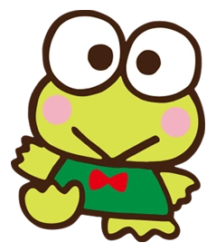

<html>
  <head>
    <meta charset="UTF-8" />
    <title>Ashelie's website</title>
  </head>
  <link rel="stylesheet" href="styles.css" />
  <body>
    <h1>About me!</h1>
    <h2>
      My name is Ashelie! I'm a Software Engineer Intern at Stile from the US!
      😁
    </h2>
    

    
    

    <h1>Two truths and a lie!</h1>
    <h2>Click which one is the lie and I will tell you if you are correct!</h2>

    <a href="/duck.html">
      <button class="button">I have a pet duck.</button>
    </a>

    <a href="/wwii.html">
      <button class="button">My grandfather fought in World War II.</button>
    </a>

    <a href="/languages.html">
      <button class="button">I speak 3 languages.</button>
    </a>
  </body>
</html>
